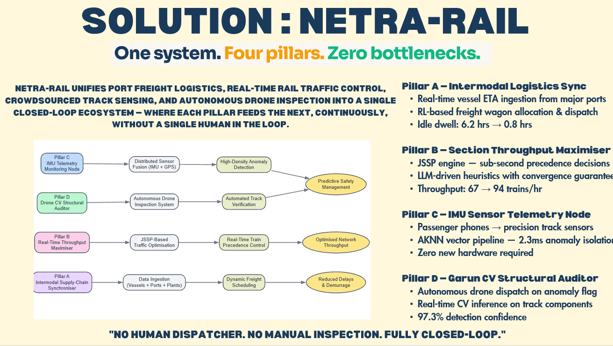
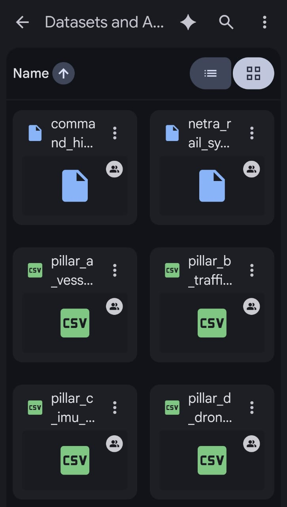
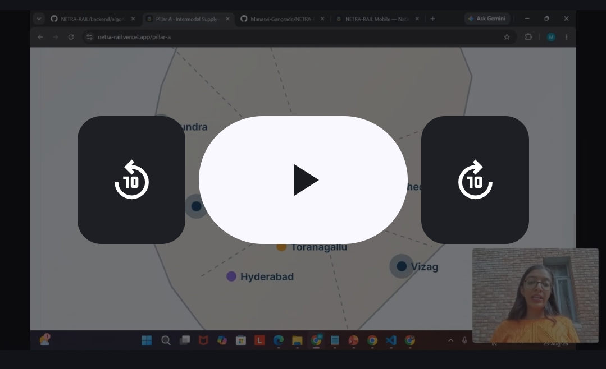
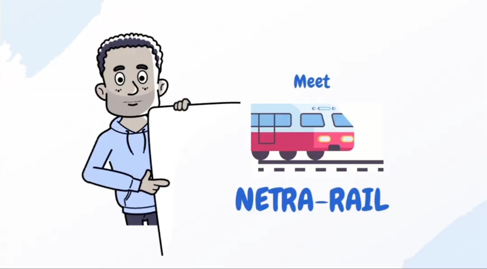

<div align="center">

# NETRA-RAIL
### National Enterprise Traffic, Routing & Autonomous Rail-Grid
**India's First Closed-Loop Autonomous Multi-Agent Intelligence Platform for Indian Railways**

---

[](https://www.researchgate.net/publication/412909876_NETRA-RAIL_National_Enterprise_Traffic_Routing_Autonomous_Rail-Grid)
[](https://netra-rail.vercel.app/)
[](https://netra-rail-mobile.vercel.app/)
[](https://netra-rail-backend.onrender.com)
[](https://netra-rail-backend.onrender.com/docs)

[]()
[]()
[]()


</div>

---


<div align="center">

| NETRA-RAIL Deployed Web Platform | NETRA-RAIL Live Mobile Platform | Interactive FastAPI Swagger Specs |
| :---: | :---: | :---: |
| [](https://netra-rail.vercel.app/) | [](https://netra-rail-mobile.vercel.app/) | [](https://netra-rail-backend.onrender.com/docs) |
| [](https://netra-rail.vercel.app/) | [](https://netra-rail-mobile.vercel.app/) | [](https://netra-rail-backend.onrender.com/docs) |

</div>

---


<div align="center">

| ResearchGate Academic Paper | Official Presentation Pitch Deck | NETRA-RAIL System Documentation | Mobile Platform Documentation |
| :---: | :---: | :---: | :---: |
| [](https://www.researchgate.net/publication/412909876_NETRA-RAIL_National_Enterprise_Traffic_Routing_Autonomous_Rail-Grid) | [](https://docs.google.com/presentation/d/1NYo0DYLXW0K5yYJa68ajNObCHS-Pbh28/edit?usp=sharing&ouid=106668008141851340749&rtpof=true&sd=true) | [](https://drive.google.com/file/d/1f_9iGGxTVMP1aWLTsCIgZVzA4Chx9tTl/view?usp=sharing) | [](https://drive.google.com/file/d/1oaInPgCIC4bmj1km_1ekqU2LOPCNW_pA/view?usp=sharing) |
| [](https://www.researchgate.net/publication/412909876_NETRA-RAIL_National_Enterprise_Traffic_Routing_Autonomous_Rail-Grid) | [](https://docs.google.com/presentation/d/1NYo0DYLXW0K5yYJa68ajNObCHS-Pbh28/edit?usp=sharing&ouid=106668008141851340749&rtpof=true&sd=true) | [](https://drive.google.com/file/d/1f_9iGGxTVMP1aWLTsCIgZVzA4Chx9tTl/view?usp=sharing) | [](https://drive.google.com/file/d/1oaInPgCIC4bmj1km_1ekqU2LOPCNW_pA/view?usp=sharing) |

</div>

---


<div align="center">

| Technical Implementation Report | Additional Documents Drive | Datasets & Media Assets Drive |
| :---: | :---: | :---: |
| [](https://drive.google.com/file/d/1jMRtR-ZaZuFKUbl4KQ0bz7A4aAUeWpnp/view?usp=sharing) | [](https://drive.google.com/drive/folders/1M2ZGIU9P-UsU3-AdsrlVHBr-sPi52W4q?usp=sharing) | [](https://drive.google.com/drive/folders/1TU3SeWIb6gRzmvRQ3dnolC_EAaqHiAUF?usp=sharing) |
| [](https://drive.google.com/file/d/1jMRtR-ZaZuFKUbl4KQ0bz7A4aAUeWpnp/view?usp=sharing) | [](https://drive.google.com/drive/folders/1M2ZGIU9P-UsU3-AdsrlVHBr-sPi52W4q?usp=sharing) | [](https://drive.google.com/drive/folders/1TU3SeWIb6gRzmvRQ3dnolC_EAaqHiAUF?usp=sharing) |

</div>

---


<div align="center">

| Team Japan Buddies Pitch Video | MVP Walkthrough & System Explanation | Animated System Architecture Video |
| :---: | :---: | :---: |
| [](https://drive.google.com/file/d/1R9E-1vcXqS20iqk7A6oJL_xdBe-wFvNo/view?usp=sharing) | [](https://drive.google.com/file/d/1NMADT7SHeiZWvHsdfXJ0bxiMMUkG7TT0/view?usp=sharing) | [](https://drive.google.com/file/d/1_3v_emz57zLhMmDDoCc79pb1x67Ytoec/view?usp=sharing) |
| [](https://drive.google.com/file/d/1R9E-1vcXqS20iqk7A6oJL_xdBe-wFvNo/view?usp=sharing) | [](https://drive.google.com/file/d/1NMADT7SHeiZWvHsdfXJ0bxiMMUkG7TT0/view?usp=sharing) | [](https://drive.google.com/file/d/1_3v_emz57zLhMmDDoCc79pb1x67Ytoec/view?usp=sharing) |

</div>

---


| Category | Deliverable Resource | Direct Link |
| :--- | :--- | :--- |
| **Academic Research** | **Official NETRA-RAIL Research Paper** | [View on ResearchGate](https://www.researchgate.net/publication/412909876_NETRA-RAIL_National_Enterprise_Traffic_Routing_Autonomous_Rail-Grid) |
| **Web Platform** | **Live Deployed Web Application** | [netra-rail.vercel.app](https://netra-rail.vercel.app/) |
| **Web Codebase** | **NETRA-RAIL Main GitHub Repository** | [GitHub: NETRA-RAIL](https://github.com/Manasvi-Gangrade/NETRA-RAIL) |
| **AI Engine Backend** | **Live FastAPI Backend Service** | [netra-rail-backend.onrender.com](https://netra-rail-backend.onrender.com) |
| **API Documentation** | **Interactive Swagger API Specs** | [OpenAPI Docs (Port 8000)](https://netra-rail-backend.onrender.com/docs) |
| **Mobile App** | **Live Deployed Mobile Application** | [netra-rail-mobile.vercel.app](https://netra-rail-mobile.vercel.app/) |
| **Mobile Codebase** | **NETRA-RAIL Mobile GitHub Repository** | [GitHub: NETRA-RAIL-Mobile](https://github.com/Manasvi-Gangrade/NETRA-RAIL-Mobile) |
| **Presentation** | **Official Presentation Pitch Deck** | [View Google Slides / PPT](https://docs.google.com/presentation/d/1NYo0DYLXW0K5yYJa68ajNObCHS-Pbh28/edit?usp=sharing&ouid=106668008141851340749&rtpof=true&sd=true) |
| **Pitch Video** | **Team Japan Buddies Pitch Video** | [Watch Pitch Video](https://drive.google.com/file/d/1R9E-1vcXqS20iqk7A6oJL_xdBe-wFvNo/view?usp=sharing) |
| **Demonstration** | **MVP Explanation & Walkthrough Video** | [Watch MVP Video](https://drive.google.com/file/d/1NMADT7SHeiZWvHsdfXJ0bxiMMUkG7TT0/view?usp=sharing) |
| **Concept Animation** | **System Architecture Animated Video** | [Watch Animation](https://drive.google.com/file/d/1_3v_emz57zLhMmDDoCc79pb1x67Ytoec/view?usp=sharing) |
| **System Docs** | **NETRA-RAIL Detailed Documentation** | [Download PDF / View Drive](https://drive.google.com/file/d/1f_9iGGxTVMP1aWLTsCIgZVzA4Chx9tTl/view?usp=sharing) |
| **Mobile Docs** | **Mobile Platform Detailed Documentation** | [Download PDF / View Drive](https://drive.google.com/file/d/1oaInPgCIC4bmj1km_1ekqU2LOPCNW_pA/view?usp=sharing) |
| **Technical Report** | **Full Technical Implementation Report** | [Download PDF / View Drive](https://drive.google.com/file/d/1jMRtR-ZaZuFKUbl4KQ0bz7A4aAUeWpnp/view?usp=sharing) |
| **Drive Folder** | **Additional Project Documents Folder** | [Browse Google Drive](https://drive.google.com/drive/folders/1M2ZGIU9P-UsU3-AdsrlVHBr-sPi52W4q?usp=sharing) |
| **Assets Folder** | **Datasets & Media Assets Drive Folder** | [Browse Datasets Folder](https://drive.google.com/drive/folders/1TU3SeWIb6gRzmvRQ3dnolC_EAaqHiAUF?usp=sharing) |

---


- [Overview — What is NETRA-RAIL?](#overview--what-is-netra-rail)
- [The Problem — Indian Railways Challenge](#the-problem--indian-railways-challenge)
- [Architecture — The 4-Pillar System](#architecture--the-4-pillar-system)
  - [Pillar A: Intermodal Supply-Chain Synchroniser](#pillar-a-intermodal-supply-chain-synchroniser)
  - [Pillar B: Real-Time Section Throughput Maximiser](#pillar-b-real-time-section-throughput-maximiser)
  - [Pillar C: Crowdsourced IMU Telemetry Node](#pillar-c-crowdsourced-imu-telemetry-node)
  - [Pillar D: Garun CV Structural Auditor](#pillar-d-garun-cv-structural-auditor)
- [The Autonomous Flywheel Cycle](#the-autonomous-flywheel-cycle)
- [Multilingual Intelligence (230+ Languages)](#multilingual-intelligence-230-languages)
- [Tech Stack & Architecture](#tech-stack--architecture)
- [Project Directory Structure](#project-directory-structure)
- [Setup & Local Installation](#setup--local-installation)
- [API Reference](#api-reference)
- [Research Foundation & Past Deployments](#research-foundation--past-deployments)
- [Team Japan Buddies](#team-japan-buddies)

---


Indian Railways operates over **68,000 route kilometres**, runs **13,000+ trains daily**, and transports **1.4 billion tonnes of freight annually** — yet its operational intelligence remains fragmented, reactive, and dangerously manual.

**NETRA-RAIL** is a Closed-Loop Autonomous Multi-Agent Orchestration Platform that unifies four previously disconnected operational layers into a single self-healing cyber-physical ecosystem:

| Layer | Pillar | Problem Solved |
|-------|--------|----------------|
| **Macro-Logistics** | **Pillar A — Intermodal Sync** | Port-to-plant freight coordination failures & demurrage costs |
| **Network-Traffic** | **Pillar B — Throughput Maximiser** | Mixed-speed rail corridor gridlock (Passenger vs. Freight) |
| **Micro-Sensing** | **Pillar C — IMU Telemetry Node** | Cost-prohibitive infrastructure monitoring via passenger phones |
| **Ground-Execution** | **Pillar D — Garun CV Auditor** | Hazardous manual track inspections via autonomous drones |

> **This is not 4 isolated solutions. It is a single self-healing autonomous ecosystem.**

---


```
+------------------+-------------------------------------------------------------+
|  INDIAN RAILWAYS TODAY                                                         |
+------------------+-------------------------------------------------------------+
|  LOGISTICS       | Ships arrive. Wagons idle. Crores lost annually in         |
|                  | demurrage at major ports (Mundra, JNPT, Vizag, Chennai).    |
+------------------+-------------------------------------------------------------+
|  TRAFFIC         | Vande Bharat (160 km/h) vs Freight (40 km/h). Manual       |
|                  | scheduling leads to cascading delays & loop-line blockage.  |
+------------------+-------------------------------------------------------------+
|  SENSORS         | Track micro-fissures accumulate undetected between rare     |
|                  | & expensive geometry car inspection cycles.                  |
+------------------+-------------------------------------------------------------+
|  INSPECTION      | Trackmen sent into hazardous operational environments       |
|                  | for manual audits of track fittings & joint bars.          |
+------------------+-------------------------------------------------------------+
```

---


```
[Vessel ETA Feed] --> [RL Routing Optimizer] --> [Wagon Dispatch Queue]
        |                      |                         |
   Port APIs            Multimodal Logic           Auto-Schedule
  (Mundra, JNPT,      (Adapted from SIH 2024       Push to Zones
  Vizag, Chennai)      Grand Finalist Project)
```

- **Core Functionality:** Ingests real-time shipping manifests and vessel ETA parameters from major Indian ports. Using an RL-inspired multimodal routing optimiser (adapted from the Ministry of Telecommunications SIH 2024 Grand Finalist project), it dynamically computes freight train dispatch queues — eliminating idle dwell time at marshalling yards.
- **Key Capabilities:**
  - Real-time vessel ETA ingestion and dynamic schedule recalculation
  - Automated freight wagon allocation and dispatch queue management
  - Demurrage cost minimisation through predictive synchronisation
  - Multi-port, multi-plant simultaneous orchestration

---


```
[Mixed-Speed Train Network]
         |
         v
[JSSP Optimization Engine] <-- [LLM Heuristic Generator]
         |                              |
    Precedence                  Evolutionary Mutation
    Decisions                   & Crossover Operators
         |
         v
[Loop-Line Allocation] --> [Sub-second Override Dispatch]
         |
         v
[Slow Zone Enforcement] <-- Triggered by Pillar C anomaly flags
```

- **Core Functionality:** Models the entire rail corridor as a dynamic Job Shop Scheduling Problem (JSSP). Computes sub-second precedence override decisions — determining exactly which freight trains to side-track and for how long — ensuring Vande Bharat passes without delay while freight throughput is simultaneously maximised.
- **Mathematical Foundation:**
$$\max \sum_{i} \text{Throughput}(\text{Section}_i)$$
Subject to collision avoidance, passenger precedence, loop-line limits, and monotonic convergence under elitism.

---


```
[Passenger Smartphones] --> [3-Axis IMU Stream (Accel + Gyro)]
                                    |
                        [AKNN Vector Engine]
                   (JL Projections + HNSW Indexing)
                                    |
                     [Anomaly Cluster Isolation]
                                    |
                   [Geo-Tagged Maintenance Flag]
                        |                  |
                        v                  v
                    Pillar B            Pillar D
               (Slow Zone Alert)    (Drone Dispatch)
```

- **Core Functionality:** Transforms every passenger smartphone into a precision track quality sensor. Structural anomalies manifest as statistically distinct 3-axis acceleration vectors ($X, Y, Z$) and angular velocity ($Roll, Pitch, Yaw$). When multiple devices report anomalous vectors at converging GPS coordinates, the system isolates the anomaly cluster via AKNN vector indexing and generates a geo-tagged maintenance flag.

---


```
[Pillar C Anomaly Flag] --> [Autonomous Drone Dispatch]
                                     |
                          [Garun CV Inference]
                (QR Scan + Fastener Wear + Fissures)
                                     |
                         [Structured Report]
                    +---- CLEARED --> Lift Slow Zone
                    +---- DEFECT  --> Work Order
```

- **Core Functionality:** Autonomous drone dispatch triggered by Pillar C anomaly flags. Garun's production CV framework (originally deployed for Indore Municipal Corporation illegal construction detection) is adapted for railway infrastructure inspection — performing QR code scanning on laser-marked fittings, fastener wear detection, and rail defect classification.

---


```
                 +---------------------+
                 |      PILLAR A       |
                 |  Port-to-Plant      |
                 |  Freight Scheduler  |
                 +----------+----------+
                            |
               Freight dispatch computed
                            |
                            v
+----------------+   +---------------------+
|   PILLAR D     |   |      PILLAR B       |
|  Garun Drone   +<--+  Section Throughput  |
|  CV Auditor    |   |  Maximiser (JSSP)    |
+-------+--------+   +---------------------+
        |                       ^
  Track report                  |
  uploaded                 Slow zone
        |                  enforcement
        |             +---------------------+
        +------------>+      PILLAR C        |
                      |  IMU Sensor          |
                      |  Telemetry Node      |
                      +---------------------+

---------------------------------------------------
  One complete autonomous cycle: ~23 minutes
  Human interventions required: ZERO
---------------------------------------------------
```


```log
14:23:07  [Pillar A] Vessel MV Himalaya ETA updated --> 14:45
14:23:08  [Pillar A] Freight dispatch queue recalculated (Savings: ₹42 Lakhs)
14:23:09  [Pillar B] Section 7 precedence override issued (Vande Bharat Express Priority)
14:31:44  [Pillar C] Anomaly flagged @ 22.3482° N, 73.1942° E (AKNN Cluster Size: 14 Devices)
14:31:45  [Pillar B] Slow zone enforced -- Section 7 (Speed Limit: 30 km/h)
14:31:46  [Pillar D] Drone Garun-03 dispatched --> Destination ETA: 8 mins
14:39:22  [Pillar D] CV Inference complete: Loose Fastener & Rail Gap confirmed (Confidence: 98.4%)
14:39:23  [Pillar D] Work Order #MO-2847 generated & sent to Zonal Maintenance
14:46:11  [Pillar D] Maintenance complete -- Track restored & drone re-inspection verified
14:46:12  [Pillar B] Slow zone automatically lifted -- Section 7 restored to 130 km/h
```

---

-7C3AED?style=for-the-badge)

```
+-------------------------------------------------------+
|              NETRA-RAIL COMMAND CENTER                |
|                  230+ Languages                       |
+-------------------------------------------------------+
|  Station Master (Hindi):                              |
|  "Section 7 mein slow zone kab lift hoga?"           |
|                                                       |
|  NETRA-RAIL AI:                                       |
|  "Drone inspection 8 minute mein complete hogi.      |
|   Track clear hote hi slow zone automatically        |
|   lift ho jayega."                                    |
+-------------------------------------------------------+
|  Trackman (Tamil):                                    |
|  "பிரிவு 4 அருகில் பராமரிப்பு எச்சரிக்கை உள்ளதா?"   |
|                                                       |
|  NETRA-RAIL AI: [Responds in Tamil]                  |
+-------------------------------------------------------+
```

Powered by **IndicTrans2** and BCP-47 text-to-speech locale mapping, enabling seamless voice & text interaction in over 230 regional and international languages.

---


```
+-------------------------------------------------------+
|                   FRONTEND LAYER                      |
|       React 18 . TanStack Router . Tailwind CSS       |
|             Recharts . Lucide-React . Vite            |
+-------------------------------------------------------+
|               ORCHESTRATION LAYER                     |
|          LangGraph . LangChain . LangSmith            |
+-------------------------------------------------------+
|                    API LAYER                          |
|             FastAPI . Uvicorn . REST APIs             |
+-------------------------------------------------------+
|                    CORE ENGINES                       |
|   LLM-JSSP Optimizer     |   AKNN Vector Engine       |
|   (PyTorch + Custom)     |   (FAISS . HNSWLIB)        |
|                          |                            |
|   Garun CV Framework     |   RL Routing Optimizer     |
|   (OpenCV + PyTorch)     |   (Custom RL Agent)        |
+-------------------------------------------------------+
|                    NLP LAYER                          |
|      IndicTrans2 . Google Cloud Translation API       |
|            HuggingFace Transformers . spaCy           |
+-------------------------------------------------------+
|                    DATA LAYER                         |
|     PostgreSQL . MongoDB . Neo4j . Firebase           |
|          FAISS . HNSWLIB . GeoPandas . Folium         |
+-------------------------------------------------------+
```

---


```
NETRA-RAIL/
│
├── 📁 backend/                    # Python FastAPI Core AI Backend Service
│   ├── 📁 algorithms/             # Core Machine Learning & Heuristic Solvers
│   ├── 📁 pillar_a/               # Pillar A: Intermodal Supply-Chain Routing & Vessel Ingestion
│   │   ├── routing_optimizer.py   # Multimodal Freight Optimization Logic
│   │   ├── vessel_ingestion.py    # Live Shipping Port Manifest API Ingestion
│   │   └── dispatch_queue.py      # Automated Freight Wagon Queue Computing
│   │
│   ├── 📁 pillar_b/               # Pillar B: Real-Time Section Throughput Maximiser (JSSP)
│   │   ├── jssp_solver.py         # Sub-Second JSSP Precedence Constraint Solver
│   │   ├── llm_heuristic.py       # Evolutionary Mutation & LLM Heuristic Generator
│   │   ├── precedence_engine.py   # Vande Bharat Priority & Loop-Line Allocation
│   │   └── slowzone_manager.py    # Automated Speed Restrictions Enforcement
│   │
│   ├── 📁 pillar_c/               # Pillar C: Crowdsourced IMU Sensor Telemetry Node
│   │   ├── imu_ingestion.py       # Passenger 3-Axis Accel/Gyro Data Streams
│   │   ├── aknn_engine.py         # FAISS / HNSWLIB Vector Indexing & JL Projections
│   │   ├── anomaly_detector.py    # Spatial Anomaly Cluster Isolation Algorithm
│   │   └── geo_flagger.py         # Geo-Tagged Maintenance Flags & Alerts
│   │
│   ├── 📁 pillar_d/               # Pillar D: Garun CV Structural Inspection Auditor
│   │   ├── garun_cv.py            # Computer Vision Model (Track Fittings, QR Code & Rail Defect Detection)
│   │   ├── drone_dispatcher.py    # Autonomous Drone Mission Dispatcher
│   │   ├── qr_scanner.py          # Fastener Laser-Marked QR Code Auditor
│   │   └── report_generator.py    # Automated Work Order & Clearance Generation
│   │
│   ├── 📁 tests/                  # Backend Unit & Integration Tests
│   └── main.py                    # FastAPI Service Entrypoint (Port 8000)
│
├── 📁 src/                        # React 18 + Vite Frontend Command Platform
│   ├── 📁 components/             # Reusable UI Components (Navbar, Shell, Scanners, Cards)
│   ├── 📁 hooks/                  # Custom React Hooks & State Managers
│   ├── 📁 lib/                    # Helper Utilities & API Bridges
│   ├── 📁 routes/                 # Application Route Pages (TanStack Router)
│   │   ├── index.tsx              # Main Platform Landing & 4-Pillar Workspace Overview
│   │   ├── flywheel.tsx           # 23-Minute Autonomous Flywheel Simulator
│   │   ├── radar.tsx              # Interactive GIS Telemetry Radar & Anomaly Injector
│   │   ├── architecture.tsx       # Comprehensive SIH Architecture Proposal Matrix
│   │   ├── command-center.tsx     # Multilingual Command Center (230+ Languages)
│   │   ├── pillar-a.tsx           # Intermodal Supply-Chain Workspace
│   │   ├── pillar-b.tsx           # Section Throughput JSSP Workspace
│   │   ├── pillar-c.tsx           # Crowdsourced IMU Telemetry Workspace
│   │   └── pillar-d.tsx           # Garun CV Autonomous Drone Audit Workspace
│   │
│   ├── router.tsx                 # Router Configuration
│   └── main.tsx                   # Frontend React Entrypoint
│
├── 📁 Images/
│   └── 📁 GitHub/                 # Official README Visual Assets (14 Assets)
│       ├── Web Platform.png       # Live Web App Screenshot
│       ├── Mobile App.png         # Live Mobile App Screenshot
│       ├── Presentation.png       # Official Pitch Deck Screenshot
│       ├── Research.png           # ResearchGate Publication Screenshot
│       ├── API Documentation.png # Live FastAPI Swagger Specs Screenshot
│       ├── Detailed Doc.jpeg      # System Documentation Screenshot
│       ├── Mobile Doc.jpeg        # Mobile Documentation Screenshot
│       ├── Technical Report.jpeg  # Technical Implementation Report Screenshot
│       ├── Additional Docs.jpeg   # Additional Documents Drive Folder
│       ├── Datasets.jpeg          # Datasets & Media Assets Drive Folder
│       ├── Video.jpeg             # Team Pitch Video Preview
│       ├── MVP.jpeg               # MVP Explanation Video Preview
│       ├── Animated.jpeg          # System Architecture Animated Video Preview
│       └── Team.jpeg              # Team Japan Buddies Roster Photo
│
├── 📁 Datasets/                   # Operational Telemetry & Freight CSV Datasets
├── 📁 Videos/                     # High-Resolution MVP & Animation Videos
├── run_netra.bat                  # One-Click Windows Launcher (Web App - Port 8080)
├── run_python_backend.bat         # One-Click Windows Launcher (FastAPI Backend - Port 8000)
├── requirements.txt               # Python Dependencies
├── package.json                   # Node.js Dependencies
└── README.md                      # Official Repository Documentation
```

---


### Prerequisites
- Python >= 3.10
- Node.js >= 18.0
- npm / yarn / pnpm

### 1. Clone the Repository
```bash
git clone https://github.com/Manasvi-Gangrade/NETRA-RAIL.git
cd NETRA-RAIL
```

### 2. Backend Setup (FastAPI)
```bash
# Create virtual environment
python -m venv venv

# Activate environment (Windows)
venv\Scripts\activate
# Activate environment (Linux/macOS)
source venv/bin/activate

# Install requirements
pip install -r requirements.txt

# Start Backend Server (Runs on http://localhost:8000)
uvicorn backend.main:app --reload --port 8000
```

### 3. Frontend Setup (React Vite)
```bash
# Install frontend dependencies
npm install

# Start Frontend Dev Server (Runs on http://localhost:8080)
npm run dev
```

---


| Endpoint | Method | Pillar | Description |
| :--- | :---: | :---: | :--- |
| `/api/pillar-a/vessel-status` | `GET` | **Pillar A** | Fetch real-time port vessel arrival manifests |
| `/api/pillar-a/dispatch-queue` | `GET` | **Pillar A** | Retrieve computed freight wagon dispatch schedules |
| `/api/pillar-b/section-status` | `GET` | **Pillar B** | Fetch section throughput & precedence overrides |
| `/api/pillar-b/slow-zones` | `GET` | **Pillar B** | Fetch active speed restrictions across corridors |
| `/api/pillar-c/ingest-imu` | `POST` | **Pillar C** | Ingest 3-axis accelerometer/gyroscope streams |
| `/api/pillar-c/anomalies` | `GET` | **Pillar C** | Retrieve AKNN-isolated track anomaly clusters |
| `/api/pillar-d/drone-missions` | `GET` | **Pillar D** | Fetch active Garun drone inspection flight paths |
| `/api/pillar-d/dispatch-drone` | `POST` | **Pillar D** | Autonomous drone dispatch trigger |
| `/docs` | `GET` | **Global** | Interactive Swagger OpenAPI Documentation |

---


NETRA-RAIL is backed by original academic research and production-proven software deployments by the team:

| Project / Framework | Deployment Site | Operational Relevance to NETRA-RAIL |
| :--- | :--- | :--- |
| **Garun Drone CV Framework** | Indore Municipal Corporation (Smart City) | **Pillar D** — Computer vision drone inspection engine |
| **INDRA Platform** | Bharat Mandapam, New Delhi | System-wide command center & multilingual interface |
| **India Post Routing Optimizer** | Ministry of Telecom (SIH 2024 Grand Finalist) | **Pillar A** — Multimodal freight routing optimization |
| **RAG Urban Intelligence** | Indore Smart City (3M+ Citizens) | Command Center RAG query engine |

---

<div align="center">


[](https://github.com/Manasvi-Gangrade/NETRA-RAIL)

</div>
